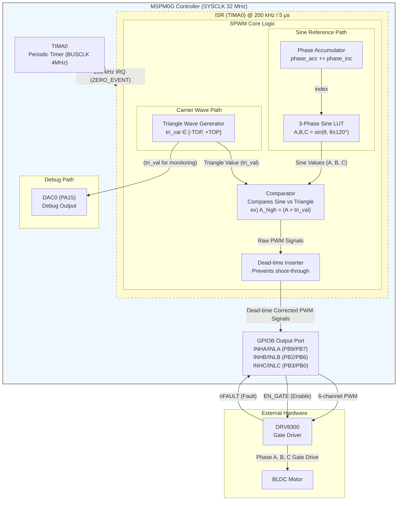

# SPWM-Generator
Using TI MSPM0 make SPWM wave

```mermaid
graph TD
    subgraph MSPM0G_Controller ["MSPM0G Controller (SYSCLK 32 MHz)"]
        style MSPM0G_Controller fill:#f0f8ff,stroke:#888,stroke-width:2px

        TIMA0["TIMA0<br>Periodic Timer (BUSCLK 4MHz)"]
        
        subgraph ISR_TIMA0 ["ISR (TIMA0) @ 200 kHz / 5 µs"]
            style ISR_TIMA0 fill:#fffacd,stroke:#888,stroke-width:1px,stroke-dasharray: 5 5
            
            subgraph SPWM_Generation [SPWM Core Logic]
                direction TB
                
                subgraph Sine_Path [Sine Reference Path]
                    PhaseAcc["Phase Accumulator<br>phase_acc += phase_inc"]
                    SineLUT["3-Phase Sine LUT<br>A,B,C = sin(θ, θ±120°)"]
                    PhaseAcc -- "index" --> SineLUT
                end

                subgraph Carrier_Path [Carrier Wave Path]
                    TriGen["Triangle Wave Generator<br>tri_val ∈ [-TOP, +TOP]"]
                end

                Comparator["Comparator<br>Compares Sine vs Triangle<br>ex) A_high = (A > tri_val)"]
                DeadTime["Dead-time Inserter<br>Prevents shoot-through"]
                
                SineLUT -- "Sine Values (A, B, C)" --> Comparator
                TriGen -- "Triangle Value (tri_val)" --> Comparator
                Comparator -- "Raw PWM Signals" --> DeadTime
            end
        end

        GPIOB["GPIOB Output Port<br>INHA/INLA (PB9/PB7)<br>INHB/INLB (PB2/PB6)<br>INHC/INLC (PB3/PB0)"]
        
        subgraph Debug [Debug Path]
            DAC0["DAC0 (PA15)<br>Debug Output"]
        end

        TIMA0 -- "200 kHz IRQ (ZERO_EVENT)" --> ISR_TIMA0
        DeadTime -- "Dead-time Corrected PWM Signals" --> GPIOB
        TriGen -- "(tri_val for monitoring)" --> DAC0
    end

    subgraph External_Components [External Hardware]
        DRV8300["DRV8300<br>Gate Driver"]
        Motor["BLDC Motor"]
    end

    GPIOB -- "6-channel PWM" --> DRV8300
    DRV8300 -- "Phase A, B, C Gate Drive" --> Motor
    
    GPIOB -- "EN_GATE (Enable)" --> DRV8300
    DRV8300 -- "nFAULT (Fault)" --> GPIOB


```
